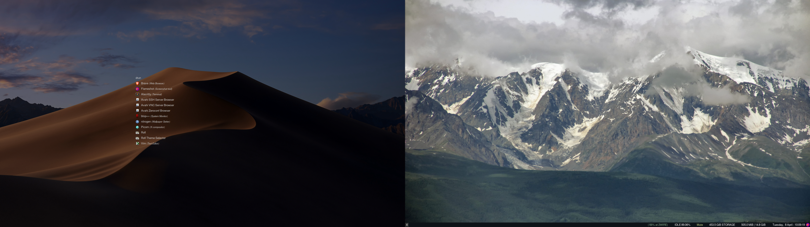

# Minmal i3wm Config
 - minimal basic config for window manager i3wm
 - my first config I've made after exploring cool topics realated to linux systems!

## Includes:
 - i3 gaps config
 - i3 status config
 - minimal clear rofi config based on the glass.rasi theme
 - font change + alacritty config nord colors with transparent bg

## Images

